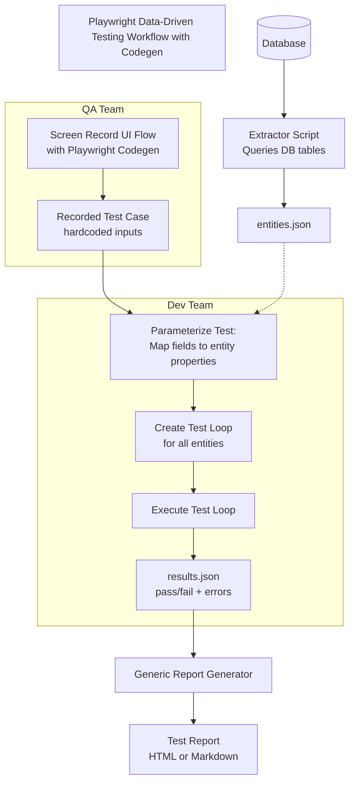

```mermaid
flowchart TD
    %% Title
    A[Playwright Data-Driven Testing Workflow with Codegen]:::title

    %% Database & Extractor
    DB[(Database)] --> Extractor[Extractor Script<br/>Queries DB tables]
    Extractor --> Entities[entities.json]:::file

    %% QA Team Section
    subgraph QA["QA Team"]
        direction TB
        Codegen[Screen Record UI Flow<br/>with Playwright Codegen] --> Recorded[Recorded Test Case<br/>hardcoded inputs]
    end

    %% Dev Team Section
    subgraph Dev["Dev Team"]
        direction TB
        Parameterize[Parameterize Test:<br/>Map fields to entity properties] 
        CreateLoop[Create Test Loop<br/>for all entities]
        Execute[Execute Test Loop] --> Results[results.json<br/>pass/fail + errors]:::file
    end

    %% Connections
   
    Recorded --> Parameterize
    Parameterize --> CreateLoop
    CreateLoop --> Execute
    
    %% New connection: entities.json feeds the test execution
    Entities -.-> Parameterize

    Results --> Report[Generic Report Generator]
    Report --> FinalReport[Test Report<br/>HTML or Markdown]:::file

```